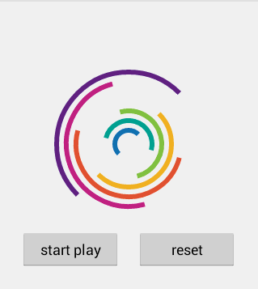

# CoolAnimation
在http://gif.flrn.nl/page/8上看到了很多好玩的动画，然后看到https://github.com/Fichardu/CircleProgress ，这哥们做了一个，于是也做了一个

#Demo


#用法
```xml
    <com.jclick.anim.CoolProgress
        android:id="@+id/progress"
        android:layout_centerInParent="true"
        android:layout_width="200dp"
        android:layout_height="200dp"/>
```

```java
progress.stopPlay();
progress.startPlay();
progress.reset();
progress.setDuration(3000);
```
